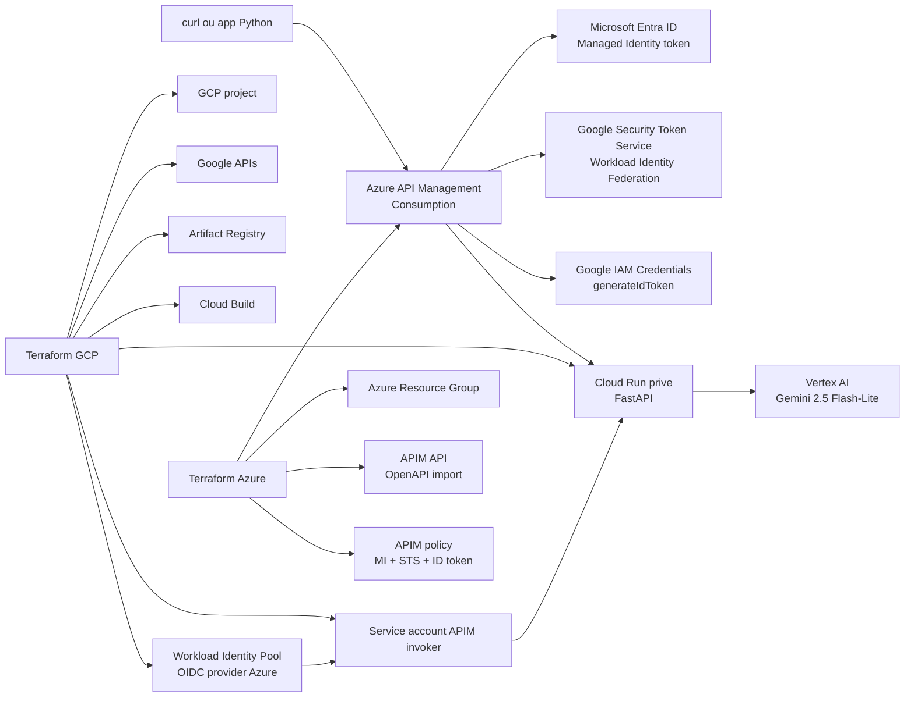

# POC Google Cloud: Cloud Run + Vertex AI Gemini + Azure APIM

Cette POC deploie une petite API Python sur Google Cloud Run. L'API expose `POST /generate`, appelle Gemini via Vertex AI, puis retourne la reponse du modele.

Le contrat de service complet de l'API est disponible dans [docs/service-contract.md](docs/service-contract.md).

La version validee expose l'API a travers Azure API Management. Cloud Run n'est pas public: APIM utilise sa managed identity Azure, l'echange via Google Workload Identity Federation, genere un ID token Google, puis appelle Cloud Run avec IAM.

Le deploiement est pilote par Terraform afin de pouvoir tout supprimer avec `terraform destroy`.

## Architecture



## Ressources deployees

GCP:

- un projet GCP dedie si `create_project=true`;
- les APIs Google Cloud: Cloud Run, Cloud Build, Artifact Registry, Vertex AI, IAM, IAM Credentials, STS et Service Usage;
- un repository Docker Artifact Registry;
- une image applicative construite par Cloud Build;
- un service account Cloud Run avec `roles/aiplatform.user`;
- un service Cloud Run prive avec `invoker_iam_disabled=false`;
- un service account Google dedie a APIM, autorise avec `roles/run.invoker`;
- un Workload Identity Pool et un provider OIDC Azure;
- une liaison `roles/iam.workloadIdentityUser` entre l'identite Azure APIM et le service account Google.

Azure:

- un Resource Group Azure dedie;
- une instance Azure API Management en SKU `Consumption_0`;
- une managed identity system-assigned sur APIM;
- une API APIM importee depuis une definition OpenAPI minimale;
- une policy APIM qui:
  - recupere un token Entra ID via managed identity;
  - l'echange contre un access token Google via STS;
  - appelle IAM Credentials `generateIdToken`;
  - envoie l'ID token Google a Cloud Run dans `Authorization: Bearer ...`.

Modele expose: `gemini-2.5-flash-lite`.

## Prerequis

Outils locaux:

```bash
gcloud --version
az version
terraform version
jq --version
curl --version
```

Authentification locale:

```bash
gcloud auth login
gcloud auth application-default login
az login
```

Un compte de facturation GCP actif est requis si Terraform cree le projet.

## Deploiement GCP

Configurer GCP:

```bash
cd /home/marc/poc-gcloud-gemini
cp terraform/terraform.tfvars.example terraform/terraform.tfvars
```

Configuration WIF validee pour cette POC:

```hcl
create_project     = true
billing_account_id = "XXXXXX-XXXXXX-XXXXXX"

region          = "us-central1"
vertex_location = "global"
gemini_model    = "gemini-2.5-flash-lite"

allow_unauthenticated    = false
enable_internal_api_key  = false
enable_azure_wif         = true
azure_tenant_id          = "<tenant-id>"
azure_apim_principal_id  = "<apim-managed-identity-principal-id>"
azure_wif_audience       = "<aud-claim-du-token-entra>"
```

Pour un premier passage, `azure_apim_principal_id` et `azure_wif_audience` ne sont connus qu'apres creation de l'APIM. Le workflow pratique est donc:

1. deployer GCP une premiere fois sans WIF complet si APIM n'existe pas encore;
2. deployer Azure APIM pour obtenir sa managed identity;
3. reporter `apim_principal_id`, `apim_tenant_id` et l'audience du token Entra dans `terraform/terraform.tfvars`;
4. reappliquer GCP pour creer le provider WIF et fermer Cloud Run au public.

Commandes GCP:

```bash
terraform -chdir=terraform init
terraform -chdir=terraform plan
terraform -chdir=terraform apply
```

Dans cette session, le projet valide est `poc-gemini-c8ef93` et Cloud Run refuse les appels directs non authentifies avec `403`.

## Deploiement Azure APIM

Preparer les variables:

```bash
cp terraform-azure-apim/terraform.tfvars.example terraform-azure-apim/terraform.tfvars
```

Variables principales:

```hcl
publisher_email  = "vous@example.com"
cloud_run_url    = "https://poc-gemini-api-xxxxx-uc.a.run.app"
backend_auth_mode = "wif"
```

Pour stabiliser l'identite APIM utilisee dans Google WIF, il est possible
d'utiliser une user-assigned managed identity:

```hcl
create_user_assigned_identity = true
```

Dans ce mode, la sortie `apim_principal_id` correspond a l'object ID stable de
la user-assigned identity. C'est cette valeur qu'il faut reporter cote GCP dans
`azure_apim_principal_id`.

Pour exiger une authentification client sur APIM avec un service principal
Entra ID, activer la validation JWT inbound:

```hcl
enable_client_sp_auth     = true
client_auth_tenant_id     = "<tenant-id>"
client_auth_audience      = "api://<app-registration-api-id>"
client_auth_allowed_roles = ["Gemini.Invoke"]
```

Le client obtient alors un token Entra ID avec le flow `client_credentials`,
puis appelle APIM avec `Authorization: Bearer <token>`.

Exemple client:

```bash
TOKEN="$(curl -sS -X POST "https://login.microsoftonline.com/<tenant-id>/oauth2/v2.0/token" \
  -H "Content-Type: application/x-www-form-urlencoded" \
  -d "client_id=<client-app-id>" \
  -d "client_secret=<client-secret>" \
  -d "grant_type=client_credentials" \
  -d "scope=api://<app-registration-api-id>/.default" | jq -r .access_token)"

curl -sS \
  -H "Authorization: Bearer $TOKEN" \
  -H "Content-Type: application/json" \
  -d '{"prompt":"Reponds en une phrase.","model":"gemini-2.5-flash-lite"}' \
  "https://<apim-name>.azure-api.net/gemini/generate" | jq .
```

Apres creation de la managed identity APIM, recuperer les outputs:

```bash
terraform -chdir=terraform-azure-apim output -raw apim_principal_id
terraform -chdir=terraform-azure-apim output -raw apim_tenant_id
```

Pour appliquer la policy WIF:

```bash
terraform -chdir=terraform-azure-apim init

terraform -chdir=terraform-azure-apim apply \
  -var='backend_auth_mode=wif' \
  -var="google_sts_audience=$(terraform -chdir=terraform output -raw azure_wif_provider_audience)" \
  -var="google_service_account_email=$(terraform -chdir=terraform output -raw apim_invoker_service_account)"
```

Endpoints APIM:

```text
https://apim-poc-gemini-k6hh7b.azure-api.net/gemini/status
https://apim-poc-gemini-k6hh7b.azure-api.net/gemini/generate
```

## Deploiement Cloud Run seul avec Artifact Registry

Un module separe est disponible dans `terraform-cloud-run-only/` pour deployer uniquement Cloud Run dans un socle GCP deja livre. Il ne cree pas le projet, n'active pas les APIs, ne configure pas l'interconnect et ne configure pas de load balancer.

Le flux cible est:

1. GitHub Actions cree le repository Artifact Registry si demande;
2. GitHub Actions construit l'image Docker depuis `app/`;
3. GitHub Actions pousse l'image dans Artifact Registry;
4. Terraform applique le service Cloud Run avec les variables Gemini et cette image Artifact Registry.

Modeles Gemini declares pour information:

```text
gemini-3.5-flash
gemini-2.5-flash
gemini-3.1-flash
gemini-2.5-flash-lite
gemini-3-pro
gemini-2.5-pro
gemini-3.1-pro
gemini-3-flash
```

L'API accepte un champ optionnel `model` sur `POST /generate`. Si le champ est absent, elle utilise `GEMINI_MODEL`. Cloud Run ne valide plus le modele contre `GEMINI_MODELS`: le filtrage des modeles autorises est porte par APIM via `allowed_gemini_models`.

Le payload peut rester minimal pour compatibilite ou utiliser les options Gemini avancees:

Exemple:

```bash
curl -sS \
  -H "Content-Type: application/json" \
  -d '{"prompt":"Resume ce besoin en une phrase.","model":"gemini-2.5-flash"}' \
  "$URL/generate" | jq .
```

Exemple avec thinking et metadonnees brutes:

```bash
curl -sS \
  -H "Content-Type: application/json" \
  -d '{
    "prompt": "Resume ce besoin en une phrase.",
    "model": "gemini-2.5-flash",
    "config": {
      "thinking_config": {
        "thinking_budget": 1024
      },
      "max_output_tokens": 512
    },
    "raw_response": true
  }' \
  "$URL/generate" | jq .
```

Exemple de sortie JSON controlee par Gemini:

```bash
curl -sS \
  -H "Content-Type: application/json" \
  -d '{
    "prompt": "Retourne un objet JSON avec les cles verdict et raison.",
    "model": "gemini-2.5-flash",
    "config": {
      "response_mime_type": "application/json"
    }
  }' \
  "$URL/generate" | jq .
```

### Variables Terraform principales

Exemple de configuration:

```hcl
project_id = "mon-projet-gcp"

region          = "us-central1"
vertex_location = "global"

service_name = "gemini-api"

artifact_registry_repository_id     = "gemini-repo"
image_name                          = "gemini-api"
image_tag                           = "a-remplacer-par-le-sha"
```

Le backend Terraform est GCS. En local ou dans CI, fournir un fichier `backend.hcl` non versionne:

```hcl
bucket = "mon-bucket-tfstate"
prefix = "poc-gcloud-gemini/cloud-run"
```

Commandes locales:

```bash
terraform -chdir=terraform-cloud-run-only init -backend-config=backend.hcl
terraform -chdir=terraform-cloud-run-only plan
terraform -chdir=terraform-cloud-run-only apply
```

### Pipeline GitHub Actions

Le workflow manuel `.github/workflows/deploy-cloud-run.yml` fait:

- authentification GCP via la cle JSON du service account Terraform;
- verification ou creation optionnelle du repository Artifact Registry avec `gcloud`;
- build et push de l'image dans Artifact Registry;
- `terraform init`, `validate`, puis `apply` sur `terraform-cloud-run-only/`.

Secrets GitHub requis:

```text
GCP_TERRAFORM_SA_KEY
```

Variables GitHub requises:

```text
GCP_PROJECT_ID
GCP_REGION
VERTEX_LOCATION
ARTIFACT_REGISTRY_REPOSITORY_ID
TF_STATE_BUCKET
TF_STATE_PREFIX
```

Le workflow se lance manuellement depuis GitHub Actions. Par defaut, le tag image est le SHA du commit; il peut etre surcharge par l'input `image_tag`.

## Tests

Se placer dans le repertoire de la POC:

```bash
cd /home/marc/poc-gcloud-gemini
```

URLs APIM actuellement deployeees:

```text
https://apim-poc-gemini-sz3ka6.azure-api.net/gemini/status
https://apim-poc-gemini-sz3ka6.azure-api.net/gemini/generate
```

Environnement remonte le 2026-06-30:

```text
GCP project: poc-gemini-169df5
Cloud Run: https://poc-gemini-api-eja5oej25q-uc.a.run.app
Cloud Run revision: poc-gemini-api-00003-kz4
APIM: https://apim-poc-gemini-sz3ka6.azure-api.net
Mode backend APIM: shared_secret
Allowed models APIM: gemini-2.5-flash-lite, gemini-2.5-flash
```

Remarque: la stack WIF APIM -> Cloud Run a ete montee puis testee, mais APIM ne transmettait pas encore un ID token Cloud Run valide. La demonstration fonctionnelle courante utilise le mode `shared_secret`: Cloud Run est invocable au niveau IAM, mais refuse les appels sans `X-Internal-Api-Key`; APIM injecte cette cle.

Verifier que Cloud Run direct est refuse:

```bash
URL="$(terraform -chdir=terraform output -raw service_url)"

curl -sS -o /tmp/direct -w '%{http_code}\n' \
  -H "Content-Type: application/json" \
  -d '{"prompt":"direct","model":"gemini-2.5-flash-lite"}' \
  "$URL/generate"
```

Resultat attendu en mode WIF prive: `403`. Resultat attendu en mode `shared_secret`: `401` si le header `X-Internal-Api-Key` est absent.

Tester le statut via APIM:

```bash
curl -sS "$(terraform -chdir=terraform-azure-apim output -raw gemini_status_url)" | jq .
```

Resultat attendu:

```json
{
  "status": "ok",
  "model": "gemini-2.5-flash-lite",
  "location": "global"
}
```

Tester la generation via APIM avec le script:

```bash
./scripts/call_apim.sh \
  "Reponds en francais en une phrase: valide le chemin APIM Managed Identity vers Cloud Run." \
  "gemini-2.5-flash-lite"
```

Equivalent manuel:

```bash
APIM_URL="$(terraform -chdir=terraform-azure-apim output -raw gemini_generate_url)"

curl -sS \
  -H "Content-Type: application/json" \
  -d '{"prompt":"Reponds en francais en une phrase: valide le workflow APIM vers Cloud Run prive via WIF.","model":"gemini-2.5-flash-lite"}' \
  "$APIM_URL" | jq .
```

Resultat attendu: `200 OK` avec un JSON contenant au minimum `model`, `location` et `text`, plus les champs Gemini disponibles comme `candidates`, `usage_metadata`, `finish_reason` et `safety_ratings`.

Tester explicitement la selection dynamique avec un autre modele. Cloud Run le relaie; APIM refuse les modeles non autorises quand `allowed_gemini_models` est renseigne:

```bash
./scripts/call_apim.sh \
  "Reponds en francais en une phrase: valide le choix dynamique du modele." \
  "gemini-2.5-flash"
```

### Demonstration des nouvelles fonctionnalites

Appel legacy `prompt`:

```bash
curl -sS \
  -H "Content-Type: application/json" \
  -d '{
    "prompt": "Reponds en francais en une phrase: valide le mode legacy prompt vers Gemini.",
    "model": "gemini-2.5-flash-lite",
    "max_output_tokens": 128
  }' \
  "https://apim-poc-gemini-sz3ka6.azure-api.net/gemini/generate" | jq .
```

Retour observe:

```json
{
  "model": "gemini-2.5-flash-lite",
  "location": "global",
  "text": "Le mode legacy prompt est valide pour Gemini.",
  "finish_reason": "STOP",
  "usage_metadata": {
    "prompt_token_count": 16,
    "candidates_token_count": 10,
    "total_token_count": 26,
    "traffic_type": "ON_DEMAND"
  }
}
```

Appel avec `thinking_config` et `raw_response`:

```bash
curl -sS \
  -H "Content-Type: application/json" \
  -d '{
    "prompt": "Reponds en francais en une phrase: confirme que la configuration thinking_config est acceptee.",
    "model": "gemini-2.5-flash",
    "config": {
      "thinking_config": {
        "thinking_budget": 512
      },
      "max_output_tokens": 160
    },
    "raw_response": true
  }' \
  "https://apim-poc-gemini-sz3ka6.azure-api.net/gemini/generate" | jq '{model, text, finish_reason, usage_metadata, has_raw_response:(.raw_response != null)}'
```

Retour observe:

```json
{
  "model": "gemini-2.5-flash",
  "text": "Oui, la configuration `thinking_config` est acceptee.",
  "finish_reason": "STOP",
  "usage_metadata": {
    "prompt_token_count": 19,
    "candidates_token_count": 13,
    "thoughts_token_count": 29,
    "total_token_count": 61,
    "traffic_type": "ON_DEMAND"
  },
  "has_raw_response": true
}
```

Appel avec sortie JSON controlee:

```bash
curl -sS \
  -H "Content-Type: application/json" \
  -d '{
    "prompt": "Retourne uniquement un objet JSON avec les cles verdict et raison pour: le wrapper expose les options Gemini avancees.",
    "model": "gemini-2.5-flash-lite",
    "config": {
      "response_mime_type": "application/json",
      "max_output_tokens": 128
    }
  }' \
  "https://apim-poc-gemini-sz3ka6.azure-api.net/gemini/generate" | jq '{model, text, parsed_text:(.text | fromjson?)}'
```

Retour observe:

```json
{
  "model": "gemini-2.5-flash-lite",
  "text": "{\n  \"verdict\": \"Pass\",\n  \"raison\": \"Le wrapper expose les options avancees de Gemini, permettant aux utilisateurs de tirer parti de toutes les fonctionnalites disponibles.\"\n}",
  "parsed_text": {
    "verdict": "Pass",
    "raison": "Le wrapper expose les options avancees de Gemini, permettant aux utilisateurs de tirer parti de toutes les fonctionnalites disponibles."
  }
}
```

Modele refuse par APIM:

```bash
curl -sS \
  -H "Content-Type: application/json" \
  -d '{"prompt":"test","model":"gemini-1.5-pro"}' \
  "https://apim-poc-gemini-sz3ka6.azure-api.net/gemini/generate"
```

Retour observe:

```json
{"error":"unsupported_model","message":"The requested Gemini model is not allowed by APIM."}
```

## Alternative: secret partage

Le module Azure APIM garde un mode de repli `shared_secret`. Dans ce mode:

- Cloud Run reste public au sens IAM;
- l'application FastAPI exige `X-Internal-Api-Key`;
- APIM injecte ce header vers le backend.

Ce mode est plus simple pour une POC rapide, mais moins propre qu'une federation d'identite. Pour l'activer:

```hcl
backend_auth_mode = "shared_secret"
backend_api_key   = "secret-partage"
```

Et cote GCP:

```hcl
allow_unauthenticated   = true
enable_internal_api_key = true
enable_azure_wif        = false
```

## Disponibiliser l'API a plusieurs clients

Pour exposer cette API a plusieurs consommateurs, APIM doit devenir le point de controle client:

- creer un produit APIM par usage: `internal`, `partner`, `sandbox`, `production`;
- activer `subscription_required=true` pour forcer une subscription key APIM par client ou application;
- associer chaque client a un produit APIM distinct;
- appliquer des quotas par produit ou par subscription;
- ajouter du rate limiting par subscription plutot que par IP;
- journaliser `context.Subscription.Id`, `context.User.Id` et un identifiant applicatif;
- exposer des chemins versionnes comme `/gemini/v1/generate`;
- separer les environnements avec des APIM/API distincts ou des revisions APIM;
- definir un contrat OpenAPI stable et importer les versions dans APIM;
- ajouter une policy de validation de payload si le schema devient plus strict;
- utiliser des Named Values APIM ou Key Vault pour les parametres sensibles si un secret reste necessaire;
- garder Cloud Run prive et n'autoriser que le service account Google impersonne par APIM.

Flux recommande pour un nouveau client:

1. creer ou choisir un produit APIM;
2. creer une subscription client;
3. appliquer quota/rate limit sur ce produit ou cette subscription;
4. fournir uniquement l'URL APIM et la subscription key, jamais l'URL Cloud Run;
5. suivre la consommation dans les logs APIM et Cloud Logging;
6. revoquer le client en supprimant ou suspendant sa subscription.

## Desinstallation

Detruire Azure APIM:

```bash
terraform -chdir=terraform-azure-apim destroy
```

Detruire GCP:

```bash
terraform -chdir=terraform destroy
```

Si `create_project=true`, Terraform detruit le projet GCP gere par cette POC.

## Bonnes pratiques appliquees

- Cloud Run n'est pas expose publiquement en mode WIF.
- APIM utilise une managed identity, sans secret long terme pour appeler Cloud Run.
- Google STS emet un access token court via Workload Identity Federation.
- IAM Credentials genere un ID token court pour Cloud Run.
- Le service account Google impersonne par APIM n'a que `roles/run.invoker`.
- L'application Cloud Run utilise son propre service account pour Vertex AI avec `roles/aiplatform.user`.
- Les states Terraform GCP et Azure sont separes pour detruire APIM sans toucher GCP.
- `min_instance_count=0` limite le cout idle de la POC.

## References

- Gemini 2.5 Flash-Lite: https://docs.cloud.google.com/vertex-ai/generative-ai/docs/models/gemini/2-5-flash-lite
- Google Gen AI SDK: https://cloud.google.com/vertex-ai/generative-ai/docs/sdks/overview
- Cloud Run authentication: https://cloud.google.com/run/docs/authenticating/service-to-service
- Workload Identity Federation: https://cloud.google.com/iam/docs/workload-identity-federation
- Azure API Management managed identity policy: https://learn.microsoft.com/en-us/azure/api-management/authentication-managed-identity-policy
- Azure API Management avec Terraform: https://learn.microsoft.com/en-us/azure/api-management/quickstart-terraform
