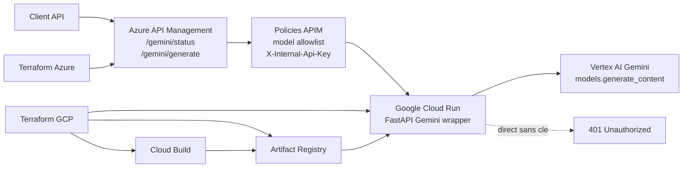

# Contrat de service API Gemini

Ce document decrit le contrat public expose par Azure API Management pour appeler le wrapper Cloud Run vers Vertex AI Gemini.

## Base URL

```text
https://apim-poc-gemini-sz3ka6.azure-api.net/gemini
```

Endpoints:

- `GET /status`
- `POST /generate`

Le backend actuellement remonte est:

```text
GCP project: poc-gemini-169df5
Cloud Run: https://poc-gemini-api-eja5oej25q-uc.a.run.app
Cloud Run revision: poc-gemini-api-00003-kz4
Vertex location: global
Default model: gemini-2.5-flash-lite
```

Le mode actif de demonstration est `shared_secret`: APIM injecte `X-Internal-Api-Key` vers Cloud Run. Les clients ne doivent jamais appeler Cloud Run directement ni connaitre cette cle.

## Architecture



## Securite et controle d'acces

- Les clients appellent uniquement APIM.
- Cloud Run exige `X-Internal-Api-Key` en mode `shared_secret`.
- APIM injecte la cle vers Cloud Run.
- APIM filtre les modeles avec `allowed_gemini_models` quand la liste est renseignee.
- Liste active pour la demonstration:
  - `gemini-2.5-flash-lite`
  - `gemini-2.5-flash`

## GET /status

Retourne l'etat du wrapper, le modele par defaut, les modeles declares et la location Vertex.

Exemple:

```bash
curl -sS "https://apim-poc-gemini-sz3ka6.azure-api.net/gemini/status" | jq .
```

Reponse `200`:

```json
{
  "status": "ok",
  "model": "gemini-2.5-flash-lite",
  "models": [
    "gemini-3.5-flash",
    "gemini-2.5-flash",
    "gemini-3.1-flash",
    "gemini-2.5-flash-lite",
    "gemini-3-pro",
    "gemini-2.5-pro",
    "gemini-3.1-pro",
    "gemini-3-flash"
  ],
  "location": "global"
}
```

## POST /generate

Genere une reponse Gemini via Vertex AI.

Headers:

```text
Content-Type: application/json
```

### Requete

```json
{
  "model": "gemini-2.5-flash-lite",
  "prompt": "Texte simple optionnel",
  "contents": "string | object | array",
  "config": {
    "temperature": 0.2,
    "top_p": 0.95,
    "top_k": 40,
    "candidate_count": 1,
    "max_output_tokens": 512,
    "stop_sequences": [],
    "response_mime_type": "application/json",
    "response_schema": {},
    "seed": 1234,
    "thinking_config": {
      "thinking_budget": 512
    }
  },
  "system_instruction": "Instruction systeme optionnelle",
  "tools": [],
  "tool_config": {},
  "safety_settings": [],
  "raw_response": false,
  "temperature": 0.2,
  "max_output_tokens": 512
}
```

Regles:

- Fournir `prompt` ou `contents`.
- Si `contents` est fourni, il est utilise comme payload Gemini principal.
- `prompt` reste disponible pour compatibilite.
- `config` est transmis a `GenerateContentConfig`.
- `temperature` et `max_output_tokens` top-level sont des raccourcis legacy. Ils sont fusionnes dans `config` seulement si la cle correspondante n'existe pas deja dans `config`.
- `system_instruction`, `tools`, `tool_config` et `safety_settings` peuvent etre fournis top-level; ils sont fusionnes dans `config`.
- `raw_response=true` ajoute une representation JSON serialisable de la reponse SDK.
- Cloud Run ne valide pas le nom du modele; APIM peut refuser un modele non autorise.

### Reponse

```json
{
  "model": "gemini-2.5-flash-lite",
  "location": "global",
  "text": "Texte genere",
  "candidates": [],
  "finish_reason": "STOP",
  "safety_ratings": [],
  "usage_metadata": {
    "prompt_token_count": 23,
    "candidates_token_count": 26,
    "total_token_count": 49,
    "traffic_type": "ON_DEMAND"
  },
  "prompt_feedback": {},
  "raw_response": {}
}
```

Champs principaux:

- `text`: texte agrege retourne par le SDK Gemini.
- `candidates`: candidats Gemini exposes par le SDK, si disponibles.
- `finish_reason`: raison de fin du premier candidat.
- `safety_ratings`: evaluations de securite du premier candidat.
- `usage_metadata`: compteurs de tokens et metadonnees d'usage. Avec thinking, peut contenir `thoughts_token_count`.
- `raw_response`: present seulement si `raw_response=true`.

## Exemples

### Prompt legacy

```bash
curl -sS \
  -H "Content-Type: application/json" \
  -d '{
    "prompt": "Reponds en francais en une phrase: donne un retour de test pour valider l API Gemini via APIM.",
    "model": "gemini-2.5-flash-lite",
    "config": {
      "max_output_tokens": 128
    }
  }' \
  "https://apim-poc-gemini-sz3ka6.azure-api.net/gemini/generate" | jq .
```

Retour observe:

```json
{
  "model": "gemini-2.5-flash-lite",
  "location": "global",
  "text": "Les tests montrent que l'API Gemini est correctement validee via APIM, repondant aux requetes attendues avec succes.",
  "finish_reason": "STOP",
  "usage_metadata": {
    "prompt_token_count": 23,
    "candidates_token_count": 26,
    "total_token_count": 49,
    "traffic_type": "ON_DEMAND"
  }
}
```

### Thinking config

```bash
curl -sS \
  -H "Content-Type: application/json" \
  -d '{
    "prompt": "Reponds en francais en une phrase: confirme que la configuration thinking_config est acceptee.",
    "model": "gemini-2.5-flash",
    "config": {
      "thinking_config": {
        "thinking_budget": 512
      },
      "max_output_tokens": 160
    },
    "raw_response": true
  }' \
  "https://apim-poc-gemini-sz3ka6.azure-api.net/gemini/generate" | jq '{model, text, finish_reason, usage_metadata, has_raw_response:(.raw_response != null)}'
```

Retour observe:

```json
{
  "model": "gemini-2.5-flash",
  "text": "Oui, la configuration `thinking_config` est acceptee.",
  "finish_reason": "STOP",
  "usage_metadata": {
    "prompt_token_count": 19,
    "candidates_token_count": 13,
    "thoughts_token_count": 29,
    "total_token_count": 61,
    "traffic_type": "ON_DEMAND"
  },
  "has_raw_response": true
}
```

### Sortie JSON

```bash
curl -sS \
  -H "Content-Type: application/json" \
  -d '{
    "prompt": "Retourne uniquement un objet JSON avec les cles verdict et raison pour: le wrapper expose les options Gemini avancees.",
    "model": "gemini-2.5-flash-lite",
    "config": {
      "response_mime_type": "application/json",
      "max_output_tokens": 128
    }
  }' \
  "https://apim-poc-gemini-sz3ka6.azure-api.net/gemini/generate" | jq '{model, text, parsed_text:(.text | fromjson?)}'
```

Retour observe:

```json
{
  "model": "gemini-2.5-flash-lite",
  "text": "{\n  \"verdict\": \"Pass\",\n  \"raison\": \"Le wrapper expose les options avancees de Gemini, permettant aux utilisateurs de tirer parti de toutes les fonctionnalites disponibles.\"\n}",
  "parsed_text": {
    "verdict": "Pass",
    "raison": "Le wrapper expose les options avancees de Gemini, permettant aux utilisateurs de tirer parti de toutes les fonctionnalites disponibles."
  }
}
```

### Contents structure

```bash
curl -sS \
  -H "Content-Type: application/json" \
  -d '{
    "contents": [
      {
        "role": "user",
        "parts": [
          {
            "text": "Reponds en francais en une phrase: valide le payload contents structure."
          }
        ]
      }
    ],
    "model": "gemini-2.5-flash-lite",
    "config": {
      "max_output_tokens": 128
    }
  }' \
  "https://apim-poc-gemini-sz3ka6.azure-api.net/gemini/generate" | jq .
```

### Modele refuse par APIM

```bash
curl -sS \
  -H "Content-Type: application/json" \
  -d '{"prompt":"test","model":"gemini-1.5-pro"}' \
  "https://apim-poc-gemini-sz3ka6.azure-api.net/gemini/generate"
```

Reponse `400`:

```json
{
  "error": "unsupported_model",
  "message": "The requested Gemini model is not allowed by APIM."
}
```

## Codes d'erreur

| Code | Source | Signification |
| --- | --- | --- |
| `400` | APIM | Modele refuse par `allowed_gemini_models`. |
| `400` | Cloud Run | Payload ou `GenerateContentConfig` invalide. |
| `401` | Cloud Run | Appel direct sans `X-Internal-Api-Key` en mode `shared_secret`. |
| `403` | Cloud Run | Appel direct refuse en mode WIF/IAM prive. |
| `502` | Cloud Run | Cloud Run est joignable, mais l'appel Vertex AI a echoue. |

## Compatibilite

Le contrat est volontairement permissif pour eviter que Cloud Run bloque les nouvelles options Gemini exposees par le SDK:

- `additionalProperties` est autorise cote OpenAPI.
- Les champs inconnus top-level sont fusionnes dans `config`.
- Les controles metier, comme la liste de modeles autorises, doivent rester cote APIM.
